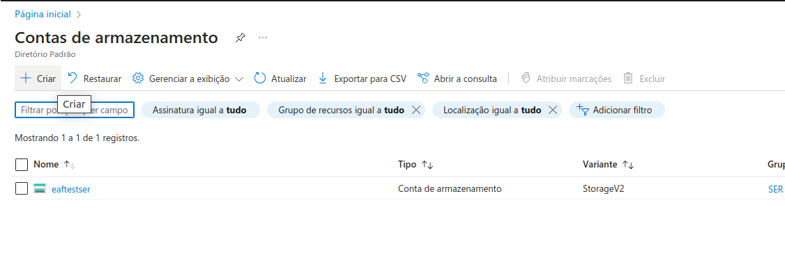

# Read Me First
The following was discovered as part of building this project:

* The original package name 'com.example.azure-storage' is invalid and this project uses 'com.example.azure_storage' instead.

# Getting Started

## Create Storage on Azure

1. Contas de Armazenamento

2. Criar uma Conta

3. Keys da conta para configurar no Application Properties
> Seguranca -> Chaves de Acesso -> em chave basta clicar em Copiar

4. Container onde estara seus arquivos estaticos
> semelhante ao Bucket do S3, nao precisa criar o codigo esta preparado para tal

### Reference Documentation
For further reference, please consider the following sections:

* [Official Gradle documentation](https://docs.gradle.org)
* [Spring Boot Gradle Plugin Reference Guide](https://docs.spring.io/spring-boot/3.3.4/gradle-plugin)
* [Create an OCI image](https://docs.spring.io/spring-boot/3.3.4/gradle-plugin/packaging-oci-image.html)
* [Azure Actuator](https://aka.ms/spring/docs/actuator)
* [Spring Boot Actuator](https://docs.spring.io/spring-boot/docs/3.3.4/reference/htmlsingle/index.html#actuator)
* [Spring Web](https://docs.spring.io/spring-boot/docs/3.3.4/reference/htmlsingle/index.html#web)
* [Azure Storage](https://microsoft.github.io/spring-cloud-azure/current/reference/html/index.html#resource-handling)

### Guides
The following guides illustrate how to use some features concretely:

* [Building a RESTful Web Service with Spring Boot Actuator](https://spring.io/guides/gs/actuator-service/)
* [Building a RESTful Web Service](https://spring.io/guides/gs/rest-service/)
* [Serving Web Content with Spring MVC](https://spring.io/guides/gs/serving-web-content/)
* [Building REST services with Spring](https://spring.io/guides/tutorials/rest/)
* [How to use the Spring Boot starter for Azure Storage](https://aka.ms/spring/msdocs/storage)

### Additional Links
These additional references should also help you:

* [Gradle Build Scans – insights for your project's build](https://scans.gradle.com#gradle)
* [Azure Storage Sample](https://aka.ms/spring/samples/latest/storage)

