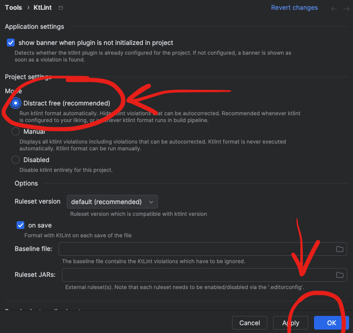

# KT Lint

### Set-up Ktlinkt in your application

Add the ktlint plugin in `build.gradle.kts`

```kts
    id("org.jlleitschuh.gradle.ktlint") version "12.1.0"
```

Run the command to verify your whole code is fixed
```
    ./gradlew ktlintCheck 
```

Run the command to fix the format of the code  
```
    ./gradlew ktlintFormat
```

### Set-up Ktlinkt on Intellij

settings > plugin > search `ktlint`


After installing and restarting, set up the autocorrect in Open Ktlint Settings


Select `Distract free (recommended)`, click `Apply` and `OK` button.



Tips:

[WildCard](https://www.jetbrains.com/help/idea/creating-and-optimizing-imports.html#automatically-add-import-statements)   


