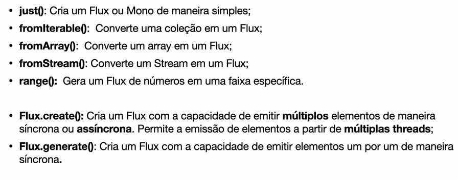

# Reactive Streams

- `Reactive Streams` is the specification    
- `Project Reactor` is the implementation   
- There are four components `Publisher`, `Subscriber`, `Subscription` and `Processor`

## Project Reactor

Project Reactor has two types of Publisher:

- `Flux:` Emit 0 to N elements
- `Mono:` Emit 1 or none element

> O Consumo só inicia com o Subscriber

### Operators

> Operators are functions that emits elements from Publisher, 
>  for instance, a Flux, bellow we have some operators of it.  

`Flux.fromIterable` Emit elements from List<T>   
`Flux.map` Emit one element at a time to convert to other type of element   
`Flux.flatMap` Emit one element at a time to convert to other type of element   
`Flux.just` Create a Flux that emits elements and then completes.      
`Flux.fromArray`   
`Flux.fromStream`   
`Flux.range`   
`Flux.range`      
`Mono.just` Create a Mono that emits one or none element and then complete it.   
   
### Flux Create Operator

> Programmatically create a Flux with the capability of emitting multiple elements in a synchronous or asynchronous manner through the FluxSink API. This includes emitting elements from multiple threads.
>  This Flux factory is useful if one wants to adapt some other multi-valued async API and not worry about cancellation and backpressure (which is handled by buffering all signals if the downstream can't keep up).

### Flux Create Generate

> Programmatically create a Flux by generating signals 
>  one-by-one via a consumer callback and some state. 
> The stateSupplier may return null.

Util para lidar com fonte de dados sincronas,
controlando de forma detalhada e sequencial.

