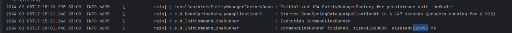
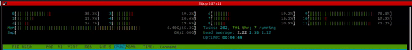
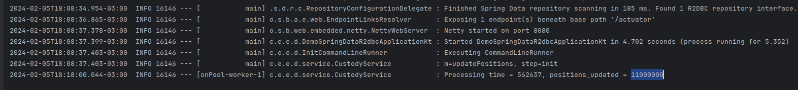
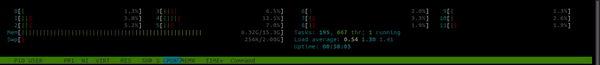
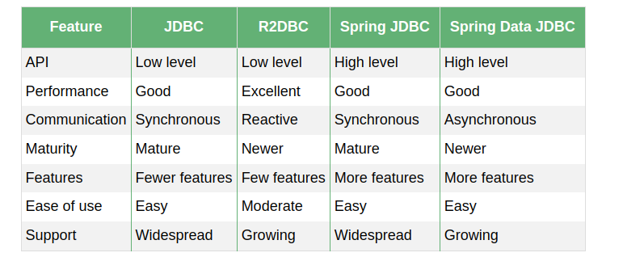

# JPA vs R2DBC

> This POC (Proof of Concept) aims to compare two ways of connecting to  Relacional Database. 
> Both we're going to use Spring Framework, the first one is the Spring-Data-JPA and the second one is Spring-Data-R2DBC.   
   
`Spring Data JPA`: Tradicional way to connect to relacional databases, **blocking manner**.
`Spring Data R2DBC`: R2DBC is the acronym which means Reactive Relational Database Connectivity, the name says everything, reactive programming to Realtional DB, i.e. **non-blocking manner**. Suitable for reactive programming and high-performance scenarios.

## 10 Milion registers on Database

#### JPA

> No Paged
Perfomed a find of `11 milion` on DB in `220.693 miliseconds` (221 sec or approximately 2 minute). 

Memory starting with `6.4gb` and finished `11.1gb`, consuming `4.6gb`

> Paged

#### R2DBC

Perfomed a find of `11 milion` on DB in `562.637 miliseconds` (562 sec or approximately 9m 01m). 

Memory starting with `6.3gb` and finished `7.1gb`, consuming `0.8gb`

. 

## 20 Milion registers on Database

#### JPA

#### R2DBC

## Decision

The following table can help us to make a decision

Ref.:

[spring-data-jpa](https://spring.io/projects/spring-data-jpa)   
[R2DBC](https://r2dbc.io/)   
[Spring Data JPA, Spring Data R2DBC & Hibernate Reactive](https://rathoreaparna678.medium.com/spring-data-jpa-spring-data-r2dbc-hibernate-reactive-49e367ab7552#:~:text=%2D%20Spring%20Data%20JPA%20is%20widely,programming%20and%20high%2Dperformance%20scenarios)      
[JDBC vs. R2DBC vs. Spring JDBC vs. Spring Data JDBC](https://www.baeldung.com/jdbc-vs-r2dbc-vs-spring-jdbc-vs-spring-data-jdbc)    

