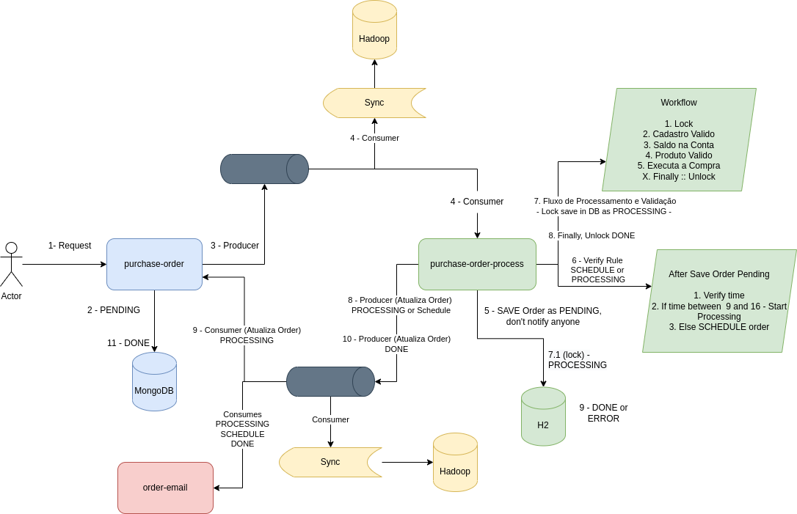

# Purchase-Order




### Run Applications + Infra
> Uping Apps with InteliJ and infra with docker
```sh
cd docker
docker-compose -f docker-compose-only-infra.yml
```

Create Kafka Connect Synk (Order-API)

```sh
curl ... # TODO

```

Create Kafka Connect Synk (Order-Process)

```sh
curl ... # TODO

```


#### Tasks

https://github.com/diegolirio/kotlin-spring-boot/issues/5


#### Defining Order

`Fields`
- id
- customer
- product
- value
- status

`Status`
- PENDING
- PROCESSING
- SCHEDULE
- DONE
- ERROR


### Technologies used:

> Order
- Spring Boot
- Reactive Programming
- MongoDB
- Kafka
- Detekt

> Order Process
- Spring Boot
- H2 Database
- Kafka
- Detekt

> Good practices 
- SOLID
- Design Pattern like Strategy, Observer, AbstractTemplate, ChainResponsability and etc...
- Clean Arch => [Draft](https://gist.github.com/diegolirio/256222e51d133fc9358d3b6a54c2e778)